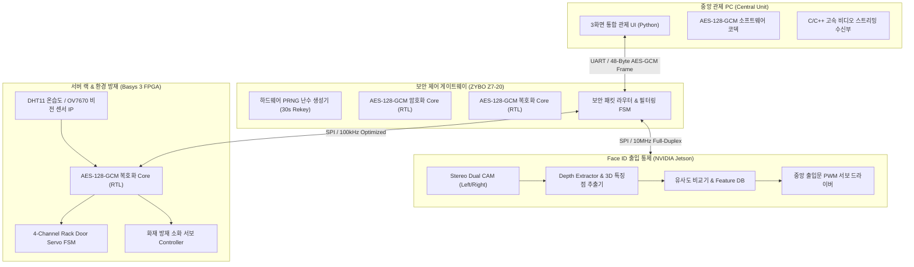

# 🛡️ A.I.G.I.S : Access Identification, Guard, and Infrastructure Status System
### FPGA 하드웨어 가속 AES-128-GCM 암호화 & AI 비전 기반 스마트 서버실 통합 관제 플랫폼

---

## 1. Project Overview


본 프로젝트는 데이터센터(서버실)의 **물리적 출입 통제**와 **내부 랙 및 환경 상태 감시**를 일원화하고, 제어 네트워크 전 구간의 보안 무결성을 보장하는 이종 하드웨어 융합형 지능형 보안 관제 시스템 (A.I.G.I.S)입니다.

* **🔒 하드웨어 가속 암호화:** FPGA 상에 Pipelined AES-128-GCM 암·복호화 RTL IP를 직접 설계하여 기밀성 및 무결성 인증 보장
* **🔑 동적 세션키 갱신 & 무손실 Handshake:** 30초마다 물리 난수($R$) 기반 세션키($K_{session} = K_{master} \oplus R$)를 갱신하며, 키 전환 충돌을 방지하는 `KEY HOLD` FSM 탑재
* **👤 AI 3D Face ID 출입 통제:** Stereo Dual CAM 기반 Depth 추출 및 3D 안면 특징점 분석을 통한 인가자/비인가자 판별 및 출입문·랙 권한 제어
* **🚨 스마트 방재 & 4채널 랙 제어:** 온습도(DHT11) 임계치 감시, 화재 감지 시 자동 소화 서보 구동, OV7670 비전 센서 이상 감지
* **🧪 UVM 기반 완전무결성 검증:** SystemVerilog UVM을 통해 난수 갱신 코너 케이스 및 비트 변조 공격에 대한 하드웨어 전수 검증 완료

---

## 2. Tech Stack

| 분류 | 항목 | 세부 사양 및 도구 |
| :--- | :--- | :--- |
| **Hardware** | **Security Gateway FPGA** | Digilent ZYBO Z7-20 (Xilinx Zynq-7000 XC7Z020) |
| | **Rack Controller FPGA** | Digilent Basys 3 (AMD Xilinx Artix-7 XC7A35T) |
| | **Edge AI Node** | NVIDIA Jetson Orin Nano |
| | **Sensors & Actuators** | DHT11 (온습도), OV7670 (비전), 서보모터 (SG90) |
| | **Camera Interface** | Digilent PCAM 5C (CCTV용), Dual USB Stereo Cam (Face ID용) |
| **Software & EDA**| **EDA & Verification** | Xilinx Vivado 2020.2, Synopsys Verdi / Vivado Simulator |
| | **Language** | SystemVerilog (RTL & UVM), C/C++ (Stream Driver), Python 3.10+ |
| | **Application / GUI** | PyQt, OpenCV, Cryptography, Pygame |
| **Protocol** | **Security & Bus** | AES-128-GCM, RAN, SPI (Mode 0), UART (Custom 48-Byte Frame) |

---

## 3. 팀원 소개 및 역할

**대한상공회의소 서울기술교육센터 온디바이스 AI 반도체 설계 1기 (1팀)**

| 이름 | 담당 역할 | 주요 구현 내용 |
| :---: | :---: | :--- |
| **전정묵 (팀장)** | **통합 시스템 검증 & IF 설계** | • SPI / UART 통신 통합 및 전체 시스템 통합 E2E 검증<br>• FPGA-Jetson-PC 간 통신 동기화 조율 |
| **강동우** | **암호화 IP & 스마트 방재 로직** | • Pipelined AES-128-GCM 하드웨어 암호화 RTL IP 설계<br>• DHT11 온습도 판정 및 소화 서보 FSM 설계, UVM 검증 |
| **신성민** | **3D 비전 & 통합 관제 UI** | • Stereo Dual CAM 기반 Depth Map 추출 및 3D 안면 인식 파이프라인 구축<br>• 3화면 멀티뷰 통합 관제 UI(Python) 및 전체 HW-SW 구조 설계 |
| **여인석** | **복호화 IP & 암호 통신 구조** | • Pipelined AES-128-GCM 하드웨어 복호화 RTL IP 설계<br>• 동적 Rekeying 및 Handshake (`KEY HOLD`) FSM 설계, ZYBO RTL 구현 |
| **윤정원** | **비전 센서 IF & 상태 검출** | • OV7670 카메라 IF 설계 및 랙 이상 징후 검출 로직 구현<br>• 카메라~관제 PC 비디오 파이프라인 검증 |
| **조아라** | **AI 인원 분류 & 랙 제어** | • AI 비전 기반 사용자 후보 특징점 추출 및 인가자 분류<br>• 4채널 RACK 개별/전체 서보모터 제어 로직 설계, UVM 검증 |

---

## 4. Architecture & Modules

### 4.1 System Block Diagram


<p align="center">
  
</p>



---

### 4.2 Security Gateway Subsystem (ZYBO Z7-20)

<!-- 📷 [이미지 2. ZYBO 보안 게이트웨이 내부 구조도 / 암복호화 파이프라인] -->
<p align="center">
  
</p>

* **하드웨어 PRNG 코어:** 30초 타이머 주기로 128-bit 물리 난수($R$) 생성 및 브로드캐스트
* **보안 라우터 (`router.sv`):** 관제 PC(UART), Jetson(SPI), Basys 3(SPI) 간 패킷 중계 및 위조 패킷(TAG 불일치) 즉시 폐기
* **Pipelined AES-128-GCM IP:** AES 암호화 블록과 GHASH 연산 블록 결합을 통한 고속 암·복호화

---

### 4.3 Secure Rack Controller Subsystem (Basys 3)

<!-- 📷 [이미지 3. Basys 3 랙 제어 및 방재 회로 블록 다이어그램] -->
<p align="center">
  
</p>

* **4채널 랙 서보 제어:** 권한 인가 패킷에 따라 타겟 랙(1~4번) 도어 PWM 서보 구동 (0.45초 도어 개폐 애니메이션 동기화)
* **스마트 방재 FSM:** DHT11 온습도 임계치 초과 또는 화재 감지 시 소화 서보 90도 회전 및 관제 비상 알림
* **OV7670 비전 모니터링:** 랙 전면 카메라 영상을 통한 이상 징후 실시간 감출

---

### 4.4 Face ID System (NVIDIA Jetson)

<!-- 📷 [이미지 4. Face ID 3D Depth 추출 및 매칭 구조도] -->
<p align="center">
  
</p>

* **Stereo 3D Depth Pipeline:** Dual CAM 시차(Disparity) 기반 3D 안면 윤곽 특징점 추출
* **유사도 매칭 & 출입문 제어:** Feature DB 비교를 통해 인가자 확인 시 중앙 출입문 잠금 해제

---

### 4.5 Central Control Station UI (Python)

<!-- 📷 [이미지 5. 3화면 통합 관제 UI 화면 모음] -->
<p align="center">
  
</p>

1. **메인 관제 화면:** 정상(CH-A) vs 오류 마스터키(CH-B) 영상 비교 스트림 & Face ID 인가 팝업
2. **랙 제어 & 암호 파이프라인:** 랙 1~4번 제어, 실시간 $K_{master} \oplus R = K_{session}$ 연산 및 데이터 흐름 시각화
3. **사용자 등록 화면:** 3D 윤곽 데이터 생성, 사용자 정보 및 랙 2×2 권한 할당

---

## 5. Security & Communication Protocol

### 5.1 48-Byte 고정 프레임 구조 (AES-128-GCM)

<!-- 📷 [이미지 6. 48-Byte 보안 패킷 구조도] -->
<p align="center">
  
</p>

| 바이트 위치 | 필드명 | 크기 | 암호화 | 기능 설명 |
| :---: | :---: | :---: | :---: | :--- |
| **0 ~ 1** | **MAGIC** | 2 Byte | 평문 | 고정 프레임 식별 헤더 (`0xA5 0x5A`) |
| **2** | **TYPE** | 1 Byte | 평문 | 패킷 타입 (`0x01` 제어, `0x06` 상태, `0x31..0x37` 키 교환) |
| **3** | **LENGTH** | 1 Byte | 평문 | Payload 길이 (`0x10`, 고정 16 Byte) |
| **4 ~ 15** | **IV (Nonce)** | 12 Byte | 평문 | 96-bit 고유 Initialization Vector |
| **16 ~ 31** | **Payload** | 16 Byte | 🔒 **암호문** | 128-bit AES-GCM 암호화된 제어 명령 / 센서 데이터 |
| **32 ~ 47** | **GCM TAG** | 16 Byte | 평문 (검증) | 128-bit GHASH 무결성 및 인증 태그 |

### 5.2 동적 세션키 생성 및 무손실 Rekeying

$$K_{session} = K_{master} \oplus R \quad (\text{단, } R \text{은 ZYBO 하드웨어 PRNG에서 30초마다 갱신되는 128-bit 난수})$$

<!-- 📷 [이미지 7. 30초 주기 동적 Rekeying 및 Handshake 흐름도] -->
<p align="center">
  
</p>

---

## 6. UVM Verification (하드웨어 검증)

<!-- 📷 [이미지 8. UVM 검증 환경 구조도 및 시뮬레이션 파형] -->
<p align="center">
  
</p>

* **30초 난수 변경 & `KEY HOLD` 검증:** 암·복호화 진행 중 난수 변경 시 `KEY HOLD`를 유지하고, 연산 완료 후 `Handshake Valid` 신호로 안전하게 세션키 스위칭
* **Constrained Random Verification:** 1,000회 이상 무작위 패킷 및 변조된 TAG/비트 반전 주입 시험 $\rightarrow$ 정상 복호화 일치율 100% 및 위조 패킷 즉각 폐기 검증

---

## 7. Troubleshooting & Optimization

<!-- 📷 [이미지 9. 트러블슈팅 전/후 성능 비교 그래프] -->
<p align="center">
  
</p>

### 7.1 CCTV 영상 스트리밍 C/C++ 드라이버 최적화
* **문제:** Python 직접 접근 방식으로 인한 심각한 프레임 저하(3 FPS) 및 지연 시간(300 ms)
* **해결:** C/C++ 기반 병렬 소켓 데이터 스트리밍 드라이버 구현

| 항목 (Metric) | 개선 전 (Python) | 개선 후 (C/C++ 최적화) | 개선 성과 |
| :--- | :---: | :---: | :---: |
| **Frame Rate** | 3 FPS | **25 FPS** | **8.3배 향상 (실시간성 확보)** 🚀 |
| **Latency** | 300 ms | **3.5 ms** | **85배 단축 (초저지연 달성)** ⚡ |

### 7.2 세션키 갱신 Handshake 동기화
* **문제:** 30초 난수 갱신 시 진행 중인 패킷의 키 불일치로 데이터 손실 발생
* **해결:** `KEY HOLD` + `Handshake Valid` FSM 적용 $\rightarrow$ **패킷 유실률 0% (Zero Drop) 달성**

### 7.3 서보 모터 제어 통신 클록 최적화
* **문제:** 10 MHz 고속 클록 노이즈로 인한 서보 모터 지터(떨림) 발생
* **해결:** 서보 제어 주파수를 **100 kHz**로 분주 최적화 $\rightarrow$ **노이즈 제거 및 구동 안정성 100% 확보**

---

## 8. Project Structure

```text
A.I.G.I.S/
├── 1팀_AIGIS_Final_Project.pdf   # 📑 프로젝트 최종 발표 자료 (PDF)
├── 1팀_AIGIS_Final_Project.pptx  # 📑 프로젝트 최종 발표 자료 (PPTX)
├── 0810_UI/                      # 🖥️ 중앙 관제 시스템 3화면 통합 UI (Python)
│   ├── app.py                    # 메인 관제 애플리케이션
│   ├── aes_gcm_128.py            # AES-128-GCM 소프트웨어 코덱
│   ├── config.json               # 관제 UI / 통신 포트 / 카메라 설정
│   ├── users.json                # 사용자 및 랙 권한 DB
│   ├── face_registry/            # 얼굴 이미지 저장소
│   └── qa/                       # 기능 시연 및 UI 캡처 이미지
├── zyboproject_inseok/           # 🛡️ ZYBO Z7-20 보안 게이트웨이 Vivado 프로젝트
│   ├── rtl/                      # AES-GCM, Router, Rekey RTL 소스
│   ├── constraints/              # XDC 핀 매핑 제약 파일
│   ├── zybo_secure_control_unit_v2.bit  # ZYBO 비트스트림
│   └── JETSON_SECURE_SPI_SPEC.md # Jetson ↔ ZYBO 간 SPI 연동 규격서
├── basys3project_inseok_jeong/   # ⚙️ Basys 3 스마트 랙 제어 Vivado 프로젝트
│   ├── rtl/                      # 4채널 랙 서보, 소화 서보, DHT11, OV7670 RTL 소스
│   ├── constraints/              # Basys 3 XDC 핀 매핑 제약 파일
│   └── basys3_secure_rack_control.bit   # Basys 3 비트스트림
└── inseok_ex/                    # 📡 확장 모듈 및 통신 테스트 스크립트
```

---

## 9. Getting Started

### 9.1 Prerequisites & Installation
```bash
cd 0810_UI
install_requirements.bat
# 또는
pip install -r ../inseok_ex/requirements.txt
```

### 9.2 Running Control Station (관제 UI 실행)
```bash
# 🔹 시뮬레이션 모드 (단독 테스트)
python app.py --simulate

# 🔹 하드웨어 연동 모드 (ZYBO 연결)
python app.py --port COM10
```

### 9.3 FPGA Programming
1. **ZYBO Z7-20:** `zyboproject_inseok/zybo_secure_control_unit_v2.bit` 다운로드
2. **Basys 3:** `basys3project_inseok_jeong/basys3_secure_rack_control.bit` 다운로드

---

## 10. License
본 프로젝트는 교육 및 연구 목적으로 제작되었습니다.  
자세한 내용은 [LICENSE](LICENSE) 파일을 참고하세요.
